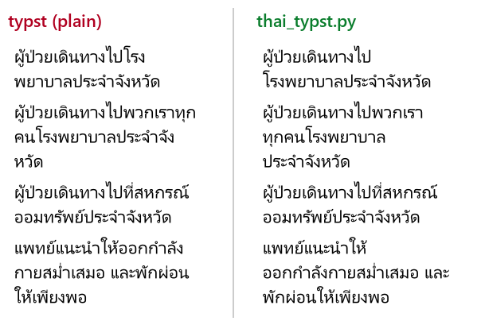
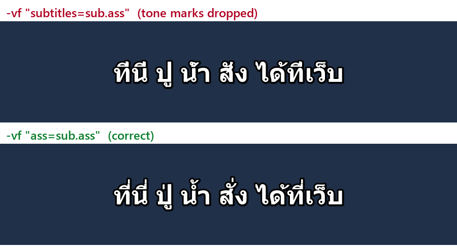

# Thai text in Typst and ffmpeg: two fixes

> **Experimental · day one (2026-10-09).** Tested on Windows 11 with Typst 0.15.1, ffmpeg 8.1.1 (gyan.dev full build), PyThaiNLP `newmm`, fonts Leelawadee UI and Tahoma. The Typst workaround is new; it replaced an earlier approach (WORD JOINER) the same day after that one broke words. Expect rough edges and please open an issue if a case breaks.

Two problems that make Thai output look wrong to a Thai reader, with a fix for each.

| Problem | Symptom | Fix |
|---|---|---|
| Typst line breaks | Breaks inside words: `โรง\|พยาบาล`, `ทุก\|คน`, `จัง\|หวัด`, `กำลัง\|กาย` | Pre-segment with a dictionary segmenter, insert ZWSP between words, wrap each word in `box()` with one show rule |
| ffmpeg burned-in subtitles | Tone marks above upper vowels disappear: `ที่นี่` → `ทีนี` | Use the `ass=` filter, not `subtitles=` |

---

## 1. Typst: Thai words split across lines



Typst segments Thai with the ICU4X LSTM model. In practice it breaks inside common compound words, which a Thai reader sees as a broken word. Upstream discussion: [typst/typst#8413](https://github.com/typst/typst/issues/8413).

### What works

1. Segment each Thai run with a dictionary segmenter (here PyThaiNLP `newmm`) and put U+200B ZERO WIDTH SPACE between words.
2. Add one show rule at the top of the document:

```typ
#show regex("[\u{0E00}-\u{0E7F}]+"): it => box(it)
```

ZWSP is outside the Thai block, so every regex match is exactly one word. A `box` cannot be broken, so the only break points left are the ZWSPs you inserted. This also works for headings and for text that comes from string variables.

### What does not work

- **ZWSP only.** It adds the right break points, but Typst still breaks inside the words.
- **ZWSP plus U+2060 WORD JOINER between letters.** In Typst 0.15.1 this is worse: it breaks right at some joiners, mid-syllable (`ออกกำลั|งกาย`, `ประชุ|ม`). U+FEFF behaves the same.
- **`justify: true`.** Boxes do not stretch, so only the real spaces widen. Keep `justify: false` for Thai with this workaround. For justification without boxes, see the `justification-limits` tip in #8413.

### Script

[`scripts/thai_typst.py`](scripts/thai_typst.py) does both steps and calls Typst:

```sh
pip install pythainlp
python scripts/thai_typst.py examples/demo.typ out.pdf      # or out.png
python scripts/thai_typst.py in.typ out.pdf --words "คำเฉพาะ,ชื่อแบรนด์"   # never split these
python scripts/thai_typst.py in.typ out.pdf --keep          # also write in.th.typ to inspect
```

- Set `TYPST` to the typst executable if it is not on `PATH`.
- Raw text (`` `code` ``, fenced blocks), comments, and string literals that look like file paths (`"รูป.png"`) are left untouched. Inserting ZWSP there would change file names and code.
- Line breaking only depends on the segmenter's dictionary. Use `--words` for names and jargon it does not know.

### Side note: copying text out of Typst PDFs

Copy-paste and text extraction of Thai from Typst PDFs can duplicate clusters (`สำหรับ` → `สำสำสำหรับ`), with or without this script. This is the general ToUnicode problem tracked in [typst/typst#8767](https://github.com/typst/typst/issues/8767), not something this workaround causes or fixes.

---

## 2. ffmpeg: tone marks vanish in burned-in Thai subtitles



Same `.ass` file ([`examples/sub.ass`](examples/sub.ass)), same font (Tahoma), same ffmpeg:

```sh
ffmpeg -i in.mp4 -vf "subtitles=sub.ass" out.mp4   # ที่นี่ -> ทีนี  (marks dropped)
ffmpeg -i in.mp4 -vf "ass=sub.ass"       out.mp4   # correct
```

In ffmpeg 8.1.1 the `subtitles` filter has no `shaping` option (`ffmpeg -h filter=subtitles`), and its output drops a tone mark when it sits on top of an upper vowel. The `ass` filter renders the same file correctly on its default `shaping=auto`. Forcing `shaping=simple` on `ass=` reproduces the broken output, which points at shaping as the cause.

This was the same in every font tried (Leelawadee UI, Tahoma, Anuphan), so changing fonts does not help. A related report for Indic scripts: [FFmpeg trac #8738](https://trac.ffmpeg.org/ticket/8738).

If you generate karaoke subtitles (`\kf` tags per word), the same rule applies: burn them with `ass=`.

---

## License

MIT. PyThaiNLP is Apache-2.0 and is installed separately.
